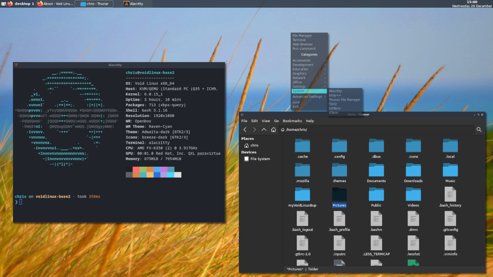

# myVoidLinuxBup
A backup of personal configs for my VoidLinux openbox setup and a set of instructions (<a href="https://github.com/testpilotuk/myVoidLinuxBup/wiki">See my Wiki</a>) I created for building a fully functioning Openbox desktop from the VoidLinux base iso. It includes some customisation and my preferred keybinds.

To include but not restricted to:

.bashrc
.vimrc
.LESS_TERMCAP
.config/openbox/autostart rc.xml
.config/tint2/tint2rc
.config/picom/picom.conf
.config/alacritty/alacritty.yml
.config/starship.toml

## Keybindings
W = super key | S = shift key | A = alt key | C = ctl key

### Program Launchers
<pre>
W-e = Leafpad GUI text editor
W-b = Firefox
W-Return = Alacritty terminal
W-S-Return = Thunar file manager
W-r = DMenu run prompt</pre>

### Changing desktops
<pre>
W-n = move to chosen desktop where n = a number between 1 and 4
W-S-n = move current window to chosen desktop where n = a number between 1 and 4</pre>

### Pseudo Window Tiling
<pre>
W-up = Maximise window
W-down = MiddleScreen
W-left = Half screen left
W-right = Half screen right
C-W-1 = Upper quarter left
C-W-2 = Lower quarter left
C-W-3 = Lower quarter right
C-W-4 = Upper quarter right

### Window focus switching
<pre>
W-l = Move focus to right window
W-h = Move focus to left window
W-k = Move focus up
W-j = Move focus down</pre>

### Other
<pre>
W-S-c = Close window
A-Space = Show menu
Print = Save screen shot with ImageMagick to Pictures dir with date plus time filename .png</pre>
